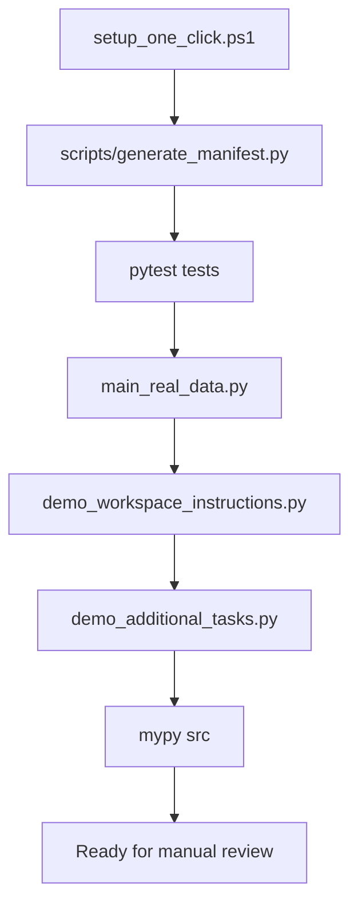

# morskamary

Repository: robertbartlomiejski/morskamary

## Quick Start

```bash
# One-click setup (recommended)
docker compose up --build

# Standard research workflow modes (Linux/macOS)
./scripts/run_research_api_full.sh --mode quick
./scripts/run_research_api_full.sh --mode full-static
./scripts/run_research_api_full.sh --mode full-live

# One-click setup (local Windows, no Docker)
powershell -ExecutionPolicy Bypass -File .\setup_one_click.ps1

# Or load real data (primary substantive results script)
python main_real_data.py

# Or run demonstration (validation/workflow-check only)
python demo_workspace_instructions.py
```

## Dynamic mode and cumulative evidence ledger

- Default research execution uses live-enriched inputs.
- Static mode is blocked for normal runs and is available only for explicit
  recovery by setting `ALLOW_STATIC_RECOVERY_MODE=true`.
- Every cumulative QMBD ledger now carries explicit run metadata
  (`analysis_input_mode`, recovery flag/reason, provider set, GitHub run ID,
  commit SHA, `timestamp_utc`) so static recovery outputs remain auditable and
  are not confused with live cumulative evidence.
- Manual supporting sources can be ingested into an append-only ledger:
  `python scripts/ingest_manual_supporting_sources.py --input <path> ...`
- Historical ZIP/unpacked output bundles can be revalidated and recoded into a
  cumulative historical index:
  `python scripts/revalidate_historical_outputs.py --input <path> ...`
- Gatekeeper validation and cross-run cumulative indexing:
  `python scripts/validate_manual_sources_gatekeeper.py --root outputs/manual_sources`
  and
  `python scripts/build_cross_run_evidence_index.py --manual-ledger outputs/manual_sources/manual_sources_ledger.jsonl`
- Artifact variable definitions for runs, evidence occurrences, manual sources,
  and historical revalidation live in
  `docs/CROSS_RUN_EVIDENCE_CODEBOOK.md` with companion schemas under `schemas/`.
- Publication-oriented methodology, content-analysis controls, statistical export
  design, and data-release policy live in:
  `docs/CUMULATIVE_DATABASE_METHODOLOGY.md`,
  `docs/CONTENT_ANALYSIS_PROTOCOL.md`,
  `docs/STATISTICAL_ANALYSIS_PLAN.md`, and
  `docs/DATA_RELEASE_POLICY.md`.

### GitHub Copilot MCP Integration (Optional Advanced Feature)

**Note:** This is optional, local, Windows-only workstation tooling. Not required for core development.

For optional full-context GitHub Copilot integration with local repositories, SharePoint, Google Drive, and scientific databases:

```powershell
# Windows PowerShell — no Administrator required
.\Deploy-CopilotSynergy.ps1 -VsCodeChannel Stable
```

See [COPILOT_MCP_SETUP.md](COPILOT_MCP_SETUP.md) for complete setup guide, including:
- Node.js >=18 and Python >=3.9 prerequisites verification
- MCP server configuration (`.vscode/mcp.json` and user-profile `mcp.json`)
- Privacy governance and data protection settings
- Advanced usage with verified DOI citations

## One-Click Setup Graph

The one-click local flow intentionally includes `demo_additional_tasks.py` as a
mandatory comprehensive validation step for AI workspace instructions, TMBD
mapping logic, and advanced micro-credential workflows.



## Purpose and Scope

Quote: "Addressing these challenges requires more than technocratic management; it demands the development of Blue Sociology." 
[Blue Sociology and the Tripartite Model]

**Reasoning:** This repository is an evidence base (policy, data, competence matrices, and draft manuscripts) for developing Blue Sociology as an applied extension of maritime sociology for the EU Sustainable Blue Economy and "one ocean" governance.

Quote: “TMBD distinguishes Marine dynamics (M)… Maritime dynamics (T)… and Oceanic dynamics (O)…” 

Blue Economy Maritime Sociology…


Reasoning: The core analytical backbone here is the Tripartite Model of Blue Dynamics (TMBD): Marine (biophysical agency), Maritime (techno-economic and institutional mediation), Oceanic (planetary governance and hydrosocial subjectivity). Documents and datasets are curated to support operationalisation, not only conceptual debate.

Quote: “Sustainable Blue Value is the equilibrium region where Re-marinisation… Re-maritimisation… and Re-oceanisation… co-occur…” 

Article_BLUE_REVISED (2)


Reasoning: The repository prioritises sources and matrices that allow the “equilibrium claim” to be tested and translated into skills, governance, and micro-credential design requirements across blue economy sectors.

Core competence spine (starting point for micro-credentials)
Quote: “Ocean literacy… Blue systems thinking… Blue economy regulations… Data & digital proficiency… Open science & data sharing…” 

Blue Social Competences Univ Sz…


Reasoning: “Blue Social Competences Univ Szczecin” is the local competence baseline. It is aligned to BlueComp-like dimensions (understanding, digital/data, sustainability/resilience, business/governance) and is used here as the minimum sociological “software” needed for blue transitions to be legitimate and implementable.

Quote: “Without this software, the hardware fails.” 

Blue Social Competences Univ Sz…


Reasoning: The repository therefore treats legitimacy, ethics, participation, governance capacity, and ocean literacy as implementation conditions (not add-ons) for offshore energy, ports, transport, tourism, marine living resources, and other sectors.

Ocean literacy, citizenship, and democratic embedding
Quote: “Blue citizenship… ensures that people’s voices, values, and concerns regarding the ocean are heard and respected in… decision-making.” 

Ocean Literacy Brief 3_0


Reasoning: Several included briefs operationalise Oceanic (O) capacity as civic and institutional competence: inclusive participation, political agenda-setting, and democratic integration of source-to-sea concerns.

Quote: “Develop and implement a comprehensive EU-wide ocean literacy strategy… connect ocean sciences with social sciences, economics, and policy studies…” 

Ocean Literacy Brief 2_0


Reasoning: This provides an EU-aligned rationale for micro-credentials that bridge marine science with sociology, governance, and economy—especially for workforce development, reskilling, and lifelong learning.

Quote: “Giving more attention to inclusivity… provides an excellent opportunity and political momentum…” 

Ocean Literacy Brief 4


Reasoning: Inclusivity is treated as an operational requirement (who participates, who benefits, whose knowledge counts, what access barriers exist) rather than a rhetorical value claim.

Open science, data governance, and citizen science
Quote: “FAIR principles (Findable, Accessible, Interoperable, Reusable)… CARE principles…” 

Ocean Decade Brief Unesco


Reasoning: The repository includes normative and procedural references for data practices, especially where blue transitions rely on multi-stakeholder data ecosystems and citizen science contributions.

Quote: “There is a profound need for inclusive and actionable ocean science that is co-designed…” 

Unesco 2026 inclusive actionabl…


Reasoning: Co-design, values, equity, and recognition of plural knowledge systems are treated as necessary conditions for actionable science-policy interfaces—directly relevant to micro-credential learning outcomes and assessment design.

What is inside (high-level inventory, aligned to use cases)

Competence and micro-credential design baselines
Blue Social Competences Univ Szczecin (xlsx/pdf/csv variants)
Blue economy skills survey and blue careers materials

Sectoral activity and evidence datasets
EMODnet human activities spreadsheets (multiple vintages)
Taxonomy and classification spreadsheets (e.g., TAC/TEC tools; ILK resource database)

Policy and strategy anchors
European Ocean Pact text file
EU Blue Economy Reports (2019–2025)
Additional EU and UN policy references relevant to ocean governance, justice, and sustainability

Research manuscripts and conceptual framework drafts
Article_BLUE_REVISED (2).docx
Blue Economy Maritime Sociology 12_02… (TMBD rewrite)
Blue Sociology and TMBD (docx/pdf variants)
From Marinization to Oceanization… (pdf)

How to use this repository (typical workflows)

## AI Assistant Customizations

This repository includes specialized instructions for AI coding assistants:

### Core Instructions
- [.github/copilot-instructions.md](.github/copilot-instructions.md) — Main workspace instructions for GitHub Copilot
  - Project overview and TMBD framework
  - Coding conventions (Python ≥3.9, black, flake8, mypy)
  - Evidence discipline and citation requirements
  - Architecture patterns and data workflows
- [docs/AGENT_WORKING_AGREEMENT.md](docs/AGENT_WORKING_AGREEMENT.md) — Shared contribution contract for humans and agents
  - Common mission lock and scientific guardrails
  - Required per-contribution declaration fields
  - Standard execution modes and validation gates

- [.github/repository-guardrails.instructions.md](.github/repository-guardrails.instructions.md) — Hard guardrails for coding agents
  - Prioritizes real-data execution (`main_real_data.py` over `demo_workspace_instructions.py`)
  - Enforces Python-first architecture (Node.js as optional MCP tooling only)
  - Maintains separation of repository and workstation-specific configurations
  - Establishes priority order: derived-data value, provenance/governance, then assistant-access

### Domain-Specific Instructions
- [.github/competence-domain.instructions.md](.github/competence-domain.instructions.md) — For competence loading scripts
  - CSV validation rules
  - Dimension → TMBD axis mapping
  - Source management and provenance tracking
  - Testing requirements

### Workflow Prompts
- [.github/add-competence.prompt.md](.github/add-competence.prompt.md) — Step-by-step workflow for adding new competences
  - Evidence gathering from repository sources
  - TMBD axis assignment with justification
  - Competence level determination
  - Testing and documentation requirements

### Skills
- [.github/integrate-literature.skill.md](.github/integrate-literature.skill.md) — Extract competences from literature
  - Search repository literature sources
  - Map paper themes to TMBD axes
  - Create competences with full citations
  - Update provenance records

## Demonstration Scripts

### [demo_workspace_instructions.py](demo_workspace_instructions.py)
Complete demonstration of workspace instructions in action:
1. **Add coastal resilience competence** with TMBD axis and evidence
2. **Create port sustainability micro-credential** with all required fields (ECTS, EQF, assessment)
3. **Analyze competence gaps** for offshore renewable energy sector
4. **Validate type safety** (Python ≥3.9, mypy conventions)

Run: `python demo_workspace_instructions.py`

## CI and Dependency Graph

### Dependency Submission

This repository uses a **repo-managed** GitHub Actions workflow
(`.github/workflows/dependency-submission.yml`) to submit dependency snapshots
to the GitHub Dependency Graph.

**Why repo-managed instead of GitHub's automatic detector?**

GitHub provides a platform-managed "Automatic Dependency Submission (Python)"
workflow, but it can fail with transient API errors (e.g.
`HttpError: An error occurred while processing your request`) and its Python
project-layout detector may not recognise this repository's structure.
The repo-managed workflow is deterministic: it pins Python 3.11, resolves
dependencies from the repo's own `requirements.txt` / `pyproject.toml`, and
submits the snapshot with an explicit `permissions: contents: write` token.

**Behaviour:**

| Condition | Action |
|---|---|
| `requirements.txt` exists | Install and submit snapshot |
| Only `pyproject.toml` exists | Install and submit snapshot |
| Neither file found | Emit a workflow warning, skip submission gracefully |

**Running alongside GitHub's automatic detector:**

Both workflows can run simultaneously without conflict — GitHub de-duplicates
snapshots by detector name. You may optionally disable GitHub's automatic
detector under *Settings → Code security and analysis → Automatic dependency
submission* if you prefer a single, controlled submission path or if the
managed workflow keeps producing failures or noise.

## Data Workflows
Quote: “Connecting Science with Society… ocean literacy and societal transformation” 

ocean-climate nexus-KI0722867EN…


Reasoning: Recommended workflows include (a) linking sectoral change evidence to societal legitimacy risks and governance needs; (b) mapping competences to sectors and to TMBD axes (M/T/O); (c) producing Europass-style micro-credential records and stackable pathways grounded in EU policy frames and Ocean Decade co-design/data-sharing norms.

Suggested citation and provenance practice (repository-level)
Quote: “Reproduction is authorised provided the source is acknowledged.” 

ocean-climate nexus-KI0722867EN…


Reasoning: Each document retains its original provenance and licensing/rights statements. When reusing any content, cite the original source document first, then cite this repository as a curated compilation that supported competence mapping and micro-credential derivation.

Suggested repository files to add (optional but recommended)

CITATION.txt (how to cite the repository and each source)

DATA_GOVERNANCE.txt (FAIR/CARE alignment + rules for derived datasets)

LLM_CONTEXT_INSTRUCTION.txt (the instruction below, versioned)

CHANGELOG.txt (what changed, when, and why, for traceability across drafts and datasets)

LLM_CONTEXT_INSTRUCTION.txt text to paste (clean repository version)

Instructional context for drafting and revising the scientific article and micro-credential outputs within this repository:

You are writing a scientific article in sociology. Use EU blue economy reference reports, treaties, pacts, and related documents. Rethink the above through Ludwik Janiszewski’s marinisation theory (marine factor + human/maritime factor), maritime social reality, and the psychosocial exception of maritime coastal communities, including the unique marine work environment of the classic social category of the people of the sea (deep-sea fishermen, merchant seafarers, shipyard workers, port dockers). The aim is to rethink, update, and extend the theoretical background of maritime sociology developed by Ludwik Janiszewski, Robert Bernard Woźniak, Adam Sosnowski, Janusz Sztumski, and later Agnieszka Kołodziej-Durnaś, Arkadiusz Kołodziej, Włodzimierz Durka, Wioleta Bryniewicz, Robert Bartłomiejski, Maciej Kowalewski, and the British branch of maritime sociology (Michael Poole, Vilheim Aubert, Bird, Hoyle, Roseberg).

Update these traditions to agential realism, wet ontologies, hydro-criticism, and posthumanist sociology of translation, while highlighting separate levels of analysis for marine (nature-biota perspective), maritime (human-social perspective), and oceanic level (posthumanistic, blue planetary, water bodies, agential materialism, Timothy Morton’s hyperobject, boundary object, and Bartłomiejski & Kowalewski’s World Ocean as superactor).

Apply the triple-dimensional configuration of the model (de-, re-, ocean-to) to all sectors of the blue economy and to the competences in BlueComp (blue competence framework). Analyse and identify emerging and established blue competences, professions, occupations, competences, skills, and careers aligned with Blue Competence and Skills. Based on them, recommend micro-credential designs applied to the tripartite model.

Definitions to apply:
Marinization (Janiszewski): the process by which societies adapt to and are shaped by marine environments, producing distinctive maritime cultures, economies, and institutions.
Maritimisation (T-axis extension): the techno-economic and institutional terraforming of the sea (ports, fleets, grids, MSP, property regimes) translating marine constraints into actionable infrastructures.
Oceanisation (O-axis): planetary-scale reconnection and governance integration treating the ocean as a coupled socio-ecological system requiring hydrosocial literacy, cross-border cooperation, and transcorporeal responsibility.

Ideate using proof-based EU blue economy policy documents and strategies and implement micro-credentials in the form of a scientific article. Start from Blue Social Competences Univ Szczecin (xlsx/pdf/csv). Be comprehensive, accurate, reliable, and relevant. Do not be over-optimistic or selectively optimising. Use Article_BLUE_REVISED and Blue Economy Maritime Sociology TMBD drafts as starting points, and keep the reasoning logic consistent with those texts.

All introduced terms must be source-justified; do not hallucinate. If evidence is not available, leave a placeholder for citation rather than inventing. Always recommend next steps and double-check credibility.
