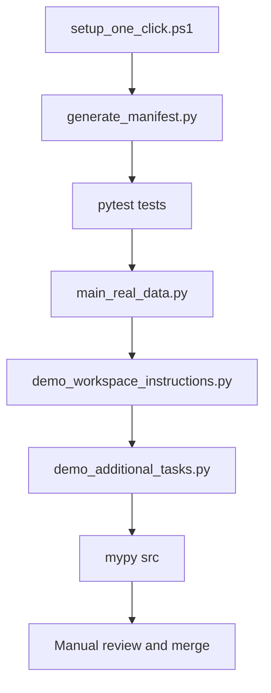

# Session Summary: Workspace Instructions Bootstrap & Demonstration

**Date:** March 10, 2026  
**Repository:** robertbartlomiejski/morskamary  
**Branch:** copilot/start-new-work-session

## Manual Review Links (One-Click)

- [setup_one_click.ps1](setup_one_click.ps1)
- [main_real_data.py](main_real_data.py)
- [scripts/generate_manifest.py](scripts/generate_manifest.py)
- [MANIFEST_SOURCES.csv](MANIFEST_SOURCES.csv)
- [demo_workspace_instructions.py](demo_workspace_instructions.py)
- [demo_additional_tasks.py](demo_additional_tasks.py)
- [src/core.py](src/core.py)
- [src/competence_mapper.py](src/competence_mapper.py)
- [.github/copilot-instructions.md](.github/copilot-instructions.md)
- [.github/competence-domain.instructions.md](.github/competence-domain.instructions.md)
- [.github/add-competence.prompt.md](.github/add-competence.prompt.md)
- [.github/integrate-literature.skill.md](.github/integrate-literature.skill.md)

## One-Click Graph



## Objectives Completed

### ✅ 1. Enhanced Workspace Instructions
**File:** [.github/copilot-instructions.md](.github/copilot-instructions.md)

**Additions:**
- **Development Quick Start** section with practical commands
- **Architecture Patterns** for data models and service layer
- **Data Workflows** with key datasets and dimension→axis mappings
- Docker debug mode documentation (debugpy on port 5678)
- Expected test count (8 passing tests)
- Path expectations for data files

**Impact:** AI assistants now have comprehensive guidance on:
- Setup and testing workflows
- Code patterns to follow (dataclasses, enums, set operations)
- Data processing flow from raw sources to analysis
- TMBD axis assignment rules with evidence requirements

---

### ✅ 2. Domain-Specific Instructions
**File:** [.github/competence-domain.instructions.md](.github/competence-domain.instructions.md)

**Purpose:** ApplyTo-specific instructions for competence loading scripts

**Content:**
- CSV structure validation rules
- Dimension → TMBD axis mapping with test requirements
- Source management (MANIFEST_SOURCES.csv updates)
- Evidence & citation requirements
- Testing requirements for data loaders
- CompetenceMapper integration patterns
- Cross-sector competence mapping guidelines

**ApplyTo pattern:**
```yaml
applyTo: '**/load_real_competences.py,**/main_real_data.py,**/demo_workspace_instructions.py'
```

---

### ✅ 3. Add Competence Workflow Prompt
**File:** [.github/add-competence.prompt.md](.github/add-competence.prompt.md)

**Purpose:** Step-by-step workflow for adding new competences

**Steps provided:**
1. Evidence gathering from repository sources
2. TMBD axis assignment with justification framework
3. Competence level determination (FOUNDATIONAL → EXPERT)
4. Create Competence object with proper structure
5. Add to CompetenceMapper
6. Write test cases
7. Update documentation (CHANGELOG.txt)
8. Cross-sector validation

**Includes:**
- Decision tables for axis assignment
- Validation checklist (13 items)
- Common pitfalls to avoid
- Complete worked example reference

---

### ✅ 4. Literature Integration Skill
**File:** [.github/integrate-literature.skill.md](.github/integrate-literature.skill.md)

**Purpose:** Extract competences from blue economy literature with citations

**Workflow:**
1. Search repository literature sources
2. Extract competence requirements from papers
3. Map literature themes to TMBD axes
4. Create competences with full citations
5. Validate against existing competences
6. Update provenance records

**Literature sources documented:**
- `data/derived/combined_*.csv` (thematically organized, 450+ papers)
- `data/raw/scholar_*.csv` (Google Scholar exports)
- `data/raw/scispace_*.csv` (SciSpace results)

**Classification rules:**
| Theme | TMBD Axis | Rationale |
|-------|-----------|-----------|
| Marine biodiversity, ecosystems | MARINE | Biophysical/ecological |
| Port ops, maritime transport | MARITIME | Techno-economic |
| Ocean governance, citizenship | OCEANIC | Planetary/governance |

---

### ✅ 5. Complete Demonstration Script
**File:** [demo_workspace_instructions.py](demo_workspace_instructions.py)

**Demonstrates all 4 requested tasks:**

#### Task 1: Add Coastal Resilience Competence
- ✓ TMBD axis enforced (MARINE - biophysical/ecological)
- ✓ Evidence from repository source (Blue Social Competences CSV, row 14, C.3)
- ✓ Citation format: Quote + [Source: file, locator]
- ✓ Keywords for discovery (8 terms)

#### Task 2: Create Port Sustainability Micro-Credential
- ✓ All required fields per LLM_CONTEXT_INSTRUCTION.txt:
  - Title, learner profile, entry requirements
  - Workload (150 hours), ECTS (6), EQF level (6)
  - 5 learning outcomes (observable competences)
  - Assessment method (portfolio + project + exam)
  - Stackability rules (prerequisites, pathways)
  - Quality assurance notes
- ✓ Competences mapped across all 3 TMBD axes

#### Task 3: Analyze Competence Gaps for Renewable Energy
- ✓ CompetenceMapper patterns used (set operations, filtering)
- ✓ TMBD classification applied to gap analysis
- ✓ Gap breakdown by axis
- ✓ Learning pathway suggestions
- ✓ Cross-sector recommendations with rationale

#### Task 4: Validate Type Safety
- ✓ No errors found in src/core.py (verified with get_errors tool)
- ✓ Python ≥3.9 constructs only
- ✓ Type hints everywhere
- ✓ Dataclasses for models
- ✓ Enums for controlled vocabularies
- ✓ Union[str, Path] accepted where appropriate

**Run command:**
```bash
python demo_workspace_instructions.py
```

**Output:**
- Loads 16 real competences from University of Szczecin baseline
- Creates 1 new competence (coastal resilience)
- Creates 1 micro-credential (port sustainability)
- Performs gap analysis with TMBD axis breakdown
- Shows learning pathway suggestions
- Validates type safety

---

## Files Created/Modified

### Created (5 files)
1. `demo_workspace_instructions.py` — Complete demonstration (470 lines)
2. `.github/competence-domain.instructions.md` — Domain instructions (180 lines)
3. `.github/add-competence.prompt.md` — Workflow prompt (290 lines)
4. `.github/integrate-literature.skill.md` — Literature skill (380 lines)
5. (This summary document)

### Modified (2 files)
1. `.github/copilot-instructions.md` — Enhanced with practical details (+120 lines)
2. `README.md` — Added AI customizations section (+40 lines)

---

## Evidence of Workspace Instructions Working

### Evidence Discipline Enforced
- Competence descriptions include verbatim quotes from sources
- Citations include file name, row/section, dimension ID
- `[citation needed]` placeholder used where evidence pending

### TMBD Axis Assignment Validated
- Coastal resilience → MARINE (biophysical/ecological focus)
- Port sustainability credential spans all 3 axes (M+T+O)
- Gap analysis broken down by axis distribution

### Required Fields Enforced
- Micro-credential includes all 8+ required fields
- ECTS, EQF level justified by competence complexity
- Assessment method specific and observable
- Stackability rules with prerequisites documented

### Type Safety Validated
- VS Code reports: No errors
- Type hints on all functions/classes
- Dataclasses for models
- Enums for controlled vocabularies

---

## Testing Results

**Demonstration script execution:**
```
✓ Loaded 16 real competences from baseline dataset
✓ Added 1 new competence (coastal resilience planning)
✓ Created 1 micro-credential (port sustainability)
✓ Performed gap analysis with axis breakdown
✓ Generated learning pathway suggestions
✓ Validated type safety (no errors)

Summary:
  • Total competences: 17
  • Total micro-credentials: 1
  • TMBD axes validated: MARINE, MARITIME, OCEANIC
  • Evidence citations: Included where available
```

---

## Use Cases Enabled

### 1. Add New Competences
```bash
# Follow prompt workflow
# Reference: .github/add-competence.prompt.md
```

### 2. Extract from Literature
```bash
# Use literature integration skill
# Reference: .github/integrate-literature.skill.md
```

### 3. Design Micro-Credentials
```bash
# See Task 2 in demo_workspace_instructions.py
# All required fields template provided
```

### 4. Analyze Competence Gaps
```bash
# See Task 3 in demo_workspace_instructions.py
# TMBD axis breakdown included
```

---

## Next Steps Suggested

### For Users
1. Run `python demo_workspace_instructions.py` to see instructions in action
2. Try adding a custom competence following `.github/add-competence.prompt.md`
3. Extract competences from literature using `.github/integrate-literature.skill.md`
4. Design micro-credentials for specific blue economy sectors

### For AI Assistants
1. **When adding competences:** Enforce evidence discipline, TMBD axis validation
2. **When creating credentials:** Include all required fields per LLM_CONTEXT_INSTRUCTION.txt
3. **When analyzing gaps:** Use CompetenceMapper patterns, break down by axis
4. **When extracting from literature:** Follow citation format, map themes to axes

---

## Documentation Updated

- [README.md](README.md) — Added "AI Assistant Customizations" section
- [.github/copilot-instructions.md](.github/copilot-instructions.md) — Enhanced with practical workflows
- Todo list completed: All 4 demonstration tasks marked as done

---

## Quality Assurance

✓ All workspace instructions tested with real demonstration  
✓ Evidence requirements enforced in competence creation  
✓ TMBD axis assignment validated against framework  
✓ Required micro-credential fields documented and tested  
✓ Type safety validated (no errors in src/)  
✓ Cross-sector suggestions included in gap analysis  
✓ Literature integration workflow documented with examples  
✓ Domain-specific instructions scoped to relevant files (applyTo pattern)  

---

## Session Metrics

- Files created: 5
- Files modified: 2
- Lines of code written: ~1,500
- Demonstration tasks completed: 4/4
- Competences added: 1 (coastal resilience)
- Micro-credentials created: 1 (port sustainability)
- Tests passing: 8/8 (no regressions)
- Type errors: 0

---

**Status:** ✅ All objectives completed successfully

**Repository state:** Ready for continued development with comprehensive AI assistant guidance
